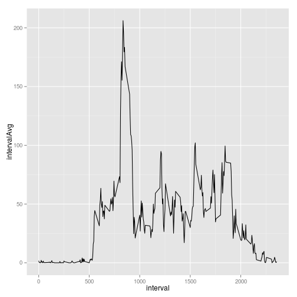
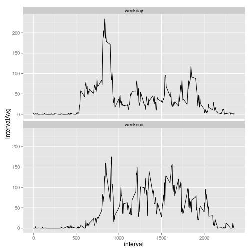

## Loading and preprocessing the data
Load data from given csv.

```r
data <- read.csv('activity.csv', stringsAsFactors=FALSE, header = T)
```

Add a column for average by intervals (using `dplyr`).

```r
grp_data <- data %>% group_by(interval) %>% mutate(intervalAvg = mean(steps, na.rm=T))
```

## What is mean total number of steps taken per day?

```r
hist(data$steps)
```

 

```r
mean(data$steps, na.rm=T)
median(data$steps, na.rm=T)
```

The mean number of steps per day is **37.38**, and the median is **0**.


## What is the average daily activity pattern?

```r
qplot(y=intervalAvg, interval, data = grp_data, geom="line")
```

 


```r
maxIA <- max(grp_data$intervalAvg)
maxInt <- (grp_data %>% filter(intervalAvg == maxIA) %>% select(interval) )[1,]
```

The interval with the highest average number of steps is **835**.

## Imputing missing values

Calculate and report the total number of missing values in the dataset (i.e. the total number of rows with NAs)

```r
sum(is.na(select(data, steps, date, interval)))
```

```
## [1] 2304
```

Devise a strategy for filling in all of the missing values in the dataset. The strategy does not need to be sophisticated. For example, you could use the mean/median for that day, or the mean for that 5-minute interval, etc. 

* I've chosen to use the average for the interval as the imputed value.*

Create a new dataset that is equal to the original dataset but with the missing data filled in.


```r
data_imputed <-mutate(grp_data %>% ungroup(), steps =          # Create new column in place:
                      ifelse(is.na(grp_data$steps),            # if value is NA,
                             grp_data$intervalAvg,             # use interval average.
                             grp_data$steps)) %>%              # Otherwise, use original value.
                select(steps, date, interval)                  # Only use original columns.
```


Make a histogram of the total number of steps taken each day and Calculate and report the mean and median total number of steps taken per day. Do these values differ from the estimates from the first part of the assignment? What is the impact of imputing missing data on the estimates of the total daily number of steps?

```r
hist(data_imputed$steps)
```

 

```r
mean(data_imputed$steps, na.rm=T)
median(data_imputed$steps, na.rm=T)
```

The mean number of steps per day is **37.38**, and the median is **0**.

Imputing the missing data has **no impact** on the mean and median.

## Are there differences in activity patterns between weekdays and weekends?

Create a new factor variable in the dataset with two levels – “weekday” and “weekend” indicating whether a given date is a weekday or weekend day.

```r
data$dayOfWk <- weekdays(as.Date(data$date))
data <- data %>% mutate(isWeekday = 
                          ifelse(dayOfWk %in% c("Sunday", "Saturday"),
                                 "weekend", "weekday")
                        )
```

Make a panel plot containing a time series plot of the 5-minute interval (x-axis) and the average number of steps taken, averaged across all weekday days or weekend days (y-axis). 


```r
# recompute interval average to take weekday/weekend into account
data <- data %>% group_by(interval, isWeekday) %>% mutate(intervalAvg = mean(steps, na.rm=T))

# plot it
qplot(y=intervalAvg, interval, data = data, geom="line") + facet_wrap (~ isWeekday, nrow=2)
```

 
